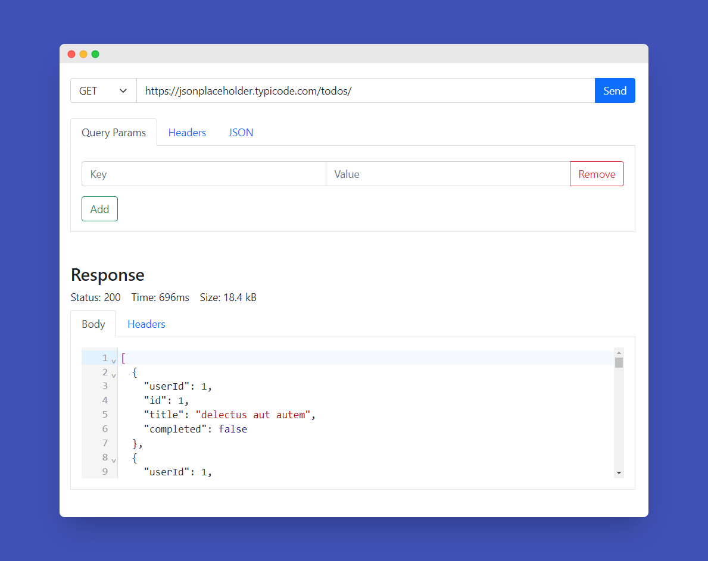

# Postman Clone

Postman clone is an example of the famous HTTP client [Postman](https://www.postman.com) made with HTML and JavaScript. 

It has minimal styling with [Bootstrap](https://getbootstrap.com/) but its key feature is the ability to make API requests and display the result in a JSON format. 

[Axios](https://www.npmjs.com/package/axios) is used to make the requests and [@codemirror/view](https://www.npmjs.com/package/@codemirror/view) text editor is used to display the result.


## Build Steps ⚙

This project was built with NodeJs -v 14.xx. Packages used includes:

    1. SnowPack 3.7.1
    2. Axios ^0.21.1
    3. Bootstrap ^5.0.2
    4. codemirror text editor ^0.18.18
    

Running Locally 🖥️
1. Clone repo using the following command:
    ```shell script
    git clone https://github.com/Itsyaboikris/postman-clone.git 
    ```
2. cd in project directory
4. Install dependencies
    ```shell script
    npm install
    ```
5. Run project 🎉
    ```shell script
    npm start
    ```

## Project structure 📁

The code for this project can be found in the following files:

- `index.html`- HTML Skeleton and styles
- `script.js`- Business Logic (Network calls)
- `setupEditor.js`- Code Mirror Editor Configuration

